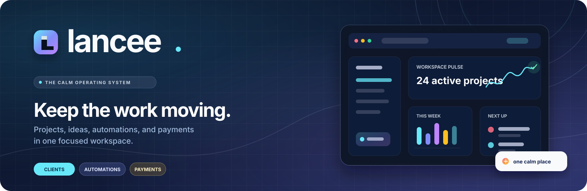

# lancee

<p align="center">
  <a href="https://lancee.hookitupservices.com">
    
  </a>
</p>

<p align="center">
  <a href="https://lancee.hookitupservices.com"></a>
  <a href="https://github.com/martin861101/lancee"></a>
  
  
  
  
</p>

<p align="center">
  <a href="docs/GETTING_STARTED.md">Get started</a> ·
  <a href="docs/PRODUCT_VISION.md">Product vision</a> ·
  <a href="docs/PLATFORM.md">Platform architecture</a> ·
  <a href="docs/AUTH_AND_NOTIFICATIONS.md">Security model</a>
</p>

> A calm, portable operating workspace for freelancers and small business
> owners — bringing client work, ideas, automations, connected tools, invoices,
> and payments into one focused place.

Built with React, TypeScript, Vite, and a small Express backend. AI is optional
and appears only where it removes meaningful effort from an existing workflow.

## Why lancee

| Focus | Flow | Craft | Control |
| --- | --- | --- | --- |
| Clients, projects, deadlines, and invoices in one workspace | Native automations, mail, Drive, n8n, and MCP connections | Offline idea boards, document workspaces, and optional storefronts | Server-side sessions, approvals, encrypted secrets, and durable audit trails |

## Start here

For a new installation, local full-stack setup, first sign-in, integrations,
SMTP, production deployment, and troubleshooting, follow
[`docs/GETTING_STARTED.md`](docs/GETTING_STARTED.md).

The standalone [lancee platform reference](lancee.html) tracks the current
product surfaces, API route families, `.env.example` configuration, and PM2/
reverse-proxy deployment shape. The deployed static copy is kept at
[`public/lancee.html`](public/lancee.html).

## Product areas

- **Public landing page** — freelancer-focused product narrative, workflow
  explanation, connection highlights, security posture, and sign-in calls to
  action.
- **Home** — projects, deadlines, outstanding invoices, useful automations,
  recent activity, and one quick-task entry point.
- **Clients** — a sidebar-accessible client directory with search, contact
  details, status controls, project counts, confirmed deletion, and a focused
  client workspace.
- **Projects** — a searchable, filterable table of every client project with
  status badges, due and created dates, ownership, pagination, quick actions,
  Drive relationships, deliverables, and authenticated project attachments.
  Selecting a project opens its full Kanban workspace with stage controls,
  persistent drag-and-drop status movement, progress, deadline, owner, files,
  external links, and Drive resources.
- **Ideas** — an MIT-licensed Excalidraw workspace for freehand drawing,
  shapes, arrows, text, images, embeddable content, reusable libraries, export,
  and keyboard/touch editing. Named boards remain attached to the lancee
  workspace and each canvas is restored locally between sessions.
- **Files** — an expandable Google Drive folder tree with persistent links to
  clients and projects, plus a lancee document library. Upload PDF, DOC/DOCX,
  Markdown, text, and image files to lancee, Drive, or both; edit supported
  documents in-app, sync local files to Drive later, and remove local workspace
  copies with a visible, confirmation-protected action. Google Picker selections
  are persisted per workspace, stale Drive results are not reintroduced from
  browser caches, folder contents load on demand, and eligible files can be
  moved to Google Drive trash. The page uses its own vertical scroll region so
  long file lists remain usable on desktop and mobile.
- **Messages** — a workspace mail app with automatic provider discovery,
  guided manual IMAP/SMTP setup, folders, search, message reading, compose and
  reply. New incoming mail can trigger native Core automations by sender,
  recipient, subject, or body keyword; these rules never use n8n.
- **Storefront** — an optional client storefront with five selectable styles
  (Black & White, Blue Splash, Gold Dune, Red Tech, and Flowish), copied source
  templates, an in-dashboard scroll-through preview, and an always-visible
  play/pause control,
  workspace-scoped opt-in, and guided custom-domain setup. The preview remains
  visible while the storefront is off, so users can decide before enabling it.
  Users enter a domain, copy the displayed DNS records, and use **Check DNS
  connection** when ready. Storefront settings also separate a full **Store
  with checkout** experience from a **Basic page** without products or checkout.
  The **Edit storefront/page** action opens a drag-and-drop section editor for
  hero and text copy, logos, product sections, calls to action, and section
  order. Editor documents are saved automatically in browser storage per
  workspace, mode, and template until a server-side content API is connected.
- **Automations** — plain-language routines for repetitive work, schedules,
  connected tools, confirmed deletion, and a dedicated **Results** screen. The
  newest run opens automatically; each completed step is shown as a readable
  outcome card, with the full returned data and execution log available on
  demand.
- **Connections** — independent backend-managed Google Drive OAuth with
  non-sensitive per-file access through Google Picker, encrypted workspace
  Paystack credentials, signed n8n webhooks, and a separate MCP gateway limited
  to browser automation and utility tools. Requests for additional business
  systems are persisted without pretending an unsupported provider is
  connected.
- **Codex Workspace** — an embedded Codex App Server connection with native
  OpenAI device login, isolated per-user auth state, sandboxed repository work,
  and streamed task output.
- **lancee AI for Codex** — a separate repo-local Codex plugin with a bundled
  MCP bridge and scoped access to the workspace AI provider and automation
  tools.
- **MCP server development plugin** — the official Anthropic
  `mcp-server-dev` Claude plugin is vendored at
  [`plugins/mcp-server-dev/`](plugins/mcp-server-dev/) for building remote
  MCP servers, MCP apps, and MCPB packages.
- **Money** — durable ZAR invoices, real Paystack hosted payment links, and
  verified, duplicate-safe webhook reconciliation.
- **Notifications** — workspace-scoped activity with unread indicators, a
  readable notification popover, navigation to related work, and mark-as-read
  controls.
- **Settings** — workspace, authentication, notification configuration, profile
  image upload/removal, and explicit logout controls.

See [`docs/PRODUCT_VISION.md`](docs/PRODUCT_VISION.md) for the target user, product
principles, information architecture, role of AI, and delivery roadmap.

## Visual system

The public landing page and authenticated dashboard share a dark navy visual
system with a subtle monochrome grain texture, translucent glass surfaces, cool
blue actions, and offset shadows. The landing narrative alternates that dark
atmosphere with calm off-white feature bands. The grain follows the low-opacity
soft-light overlay used by the Gold Dune page background without introducing
gold or brown color into the navy palette. In the dashboard, it begins after
the navigation sidebar so navigation stays clear while page content retains
depth and contrast.

The landing page uses native document scrolling so its hero and calls to action
remain reliable across desktop and mobile browsers. Its desktop navigation
stays visible as a translucent glass bar while scrolling. Hero lines and
section headings use one-time GSAP reveals; the product summary, workspace
marquee, progress display, and footer credit use lightweight ambient CSS
motion. The connection showcase includes locally rendered brand marks for
popular email, calendar, storage, communication, meeting, and payment tools.
All motion is disabled when the visitor requests reduced motion. See
[`docs/LANDING_MOTION.md`](docs/LANDING_MOTION.md) for configuration and
maintenance notes.

## Authentication

The current production build uses first-party server sessions rather than
Firebase:

- The initial administrator is configured with `ADMIN_EMAIL`.
- Passwords are verified with Node.js `scrypt`; only the salt and hash are kept.
- The browser receives a signed `HttpOnly`, `Secure`, `SameSite=Lax` cookie.
- Session bootstrap, login, and logout use `/api/auth/*`.
- Public authentication has dedicated `/signin` and `/signup` routes. Signup
  collects the account details first, sends a 24-hour email confirmation link,
  and only creates the workspace after the link is used at
  `/signup/confirm?token=…` to choose a password.
- Login is rate-limited to five failed attempts per 15-minute window.
- Mutating requests validate the request origin.
- Production registration is controlled by `ALLOW_REGISTRATION` and is enabled
  by default. Set `ALLOW_REGISTRATION=false` to disable signup; the base Docker
  Compose service explicitly enables it.
- Email confirmation requires the existing SMTP notification settings to be
  enabled and configured (`SMTP_ENABLED=true`, `SMTP_HOST`, `SMTP_PORT`, and
  `SMTP_FROM_EMAIL`).
- Owners can issue seven-day invitation links. Tokens are stored as hashes,
  can be delivered through SMTP, and create membership only after acceptance.

This is the best fit for the current platform because n8n, SMTP, MCP bearer
grants, and provider secrets already require a trusted application backend.
Firebase can later be added as an identity provider; its ID token should be
verified on this backend and exchanged for the same workspace session model.

See [`docs/AUTH_AND_NOTIFICATIONS.md`](docs/AUTH_AND_NOTIFICATIONS.md) for the security
model and SMTP setup. The administrator password is never stored in source or
documentation.

Administrator access starts at
[https://lancee.hookitupservices.com](https://lancee.hookitupservices.com) using the
configured `ADMIN_EMAIL` and its corresponding password.

## Built-in MCP capability

MCP is a platform feature, not a business-system connection users install.
Every workspace can browse the permitted agent-tool catalog immediately. The
default `MCP_ALLOWED_CATEGORIES=Browser,Utilities` boundary keeps normal
provider connections in the application backend.

The browser never receives `MCP_API_TOKEN`. The backend boundary is configured
to connect to:

```text
https://mcp.hygridtech.co.za
```

Bearer access uses a persisted, workspace-scoped state machine:

```text
available → pending or approved → activated services
```

If `MCP_API_TOKEN` is configured server-side, a request is approved
automatically. Without it, the request remains pending for a future admin grant
workflow. Bearer status and per-service activation survive process restarts in
PostgreSQL (or the local SQLite development fallback). Catalog discovery and
tool invocation are live server-to-server calls; bearer tokens never enter the
browser.
The workspace assistant uses native provider function calls to propose tools,
but the browser still shows an explicit **Approve & run** control before
invoking one. The nine built-in Lancee tools are always available to an
authenticated workspace; optional external MCP services still require their
server-side bearer grant. Invocation resolves the catalog tool id to the live
runtime at the server boundary.

See [`docs/INTEGRATIONS.md`](docs/INTEGRATIONS.md) and
[`mcp-conf/MCP.md`](mcp-conf/MCP.md).

The downloaded Claude plugin can be invoked from a Claude environment with
`/mcp-server-dev:build-mcp-server` after the project plugin directory is
registered with that environment.

## Storefront preview video

The Remotion composition lives in [`remotion/`](remotion/). Install its isolated
dependencies and render the preview into the dashboard's public assets with:

```bash
npm --prefix remotion install
npm --prefix remotion run render
```

The generated files are `public/storefront-preview*.mp4`. All styles share the
same hero → product grid → scroll → checkout flow; the selected style is
remembered per workspace in the dashboard. The copied source templates live in
[`storefront/templates`](storefront/templates). Video and byte-range requests
bypass the offline shell cache so browser playback controls receive valid MP4
range responses instead of cached partial responses.

The dashboard editor is available from **Storefront → Edit storefront/page**.
Use the left content-block palette to add sections, drag sections to reorder
them, and select a section to edit its text, logo, or products. **Basic page**
mode starts without a product block and does not show the commerce motion
preview; its editor palette also omits product sections.

## Embedded Codex Workspace

Open **Connections → Codex Workspace** to run Codex inside lancee. The backend
launches `codex app-server` over private JSONL stdio, starts the native OpenAI
device-code flow, and streams thread events to the authenticated browser over
SSE.

Each lancee workspace/user pair receives an isolated server-side `CODEX_HOME`.
Turns use a managed `lancee-workspace` permission profile limited to the fixed
`CODEX_WORKSPACE_ROOT`, minimal runtime reads, no tool network access, and no
automatic privilege escalation.

Configure local installations with:

```dotenv
CODEX_BINARY=codex
CODEX_WORKSPACE_ROOT=/absolute/path/to/project
```

The Docker image installs the pinned Codex CLI, the OS CA trust store, and the
Linux `bubblewrap` sandbox; Compose mounts `CODEX_WORKSPACE_PATH` at
`/workspace`. See
[`docs/CODEX_APP_SERVER.md`](docs/CODEX_APP_SERVER.md) for connection steps,
architecture, endpoints, security boundaries, Docker setup, and verification.

## Setup Agent and workspace operations

The conversational Setup Agent described in the onboarding documents is planned
as one workspace-scoped agent with setup and steady-state operations modes. The
implementation design covers the backend state machine, connector OAuth and
consent boundaries, asynchronous imports, knowledge ingestion, frontend
conversation/progress UI, approval gates, worker deployment, and verification:

[`docs/ONBOARDING_AGENT_IMPLEMENTATION.md`](docs/ONBOARDING_AGENT_IMPLEMENTATION.md)

The current platform foundation is ready for this work, but Gmail, Stripe,
GitHub, Slack, durable onboarding jobs, and the knowledge-base index still need
to be implemented. Existing Drive, Paystack, n8n, MCP, AI, authentication, and
workspace data boundaries should be reused as described in the design.

## lancee AI for Codex

The repo-local [`plugins/lancee-ai`](plugins/lancee-ai) plugin lets Codex use
the AI provider and workspace automations configured for an approved lancee
workspace. Its bundled MCP server exposes `connect`, `ai_status`, `complete`,
and the nine Lancee MCP tools documented in
[`docs/LANCEE_MCP.md`](docs/LANCEE_MCP.md).

The **Connections** page includes a **lancee AI for Codex** card. Open it to
enter the eight-character code shown by the plugin, review and approve the
requested `ai:invoke mcp:invoke` scopes, check active device status, or
disconnect every authorized Codex device.

Authentication uses a ten-minute device code shown by Codex and an explicit
lancee approval screen. Successful exchange issues a one-time, thirty-day
scoped token. Device codes and tokens are hashed in the database, provider
keys remain server-only, and the plugin stores its token only in the Codex
plugin data directory.

This source plugin does not modify a developer's personal Codex marketplace or
global configuration. Package the complete plugin directory into the intended
local or team marketplace. Set `LANCEE_BASE_URL` in the plugin MCP environment
only when connecting to an origin other than the production default.

See [`docs/CODEX_AI_CONNECTOR.md`](docs/CODEX_AI_CONNECTOR.md) for endpoint,
security, packaging, configuration, and verification details.

## Lancee MCP

The Lancee MCP bridge is the agent-facing surface for the platform itself. It
uses the same device approval flow as the AI connector, but requires the
separate `mcp:invoke` scope. It exposes workspace-scoped workflow search,
creation, execution, status, logs, durable scheduling, bounded external API
calls, and enabled Python/JavaScript execution.

The same runtime is available to the floating dashboard assistant. Asking it
to create a workflow produces a typed approval request; approval creates and
activates the workflow, refreshes the Automations UI, and makes it immediately
eligible for `run_workflow` or `schedule_job`.

The bridge is implemented by
[`plugins/lancee-ai/scripts/mcp-server.mjs`](plugins/lancee-ai/scripts/mcp-server.mjs)
and routes through `/api/codex/lancee-mcp/:tool`. Workflow runs reuse the
existing Core/Edge engine and Redis queue. Scheduling entries are persisted in
the database and resumed by the server scheduler. See
[`docs/LANCEE_MCP.md`](docs/LANCEE_MCP.md) for the complete tool contract and
security boundaries.

## Basebox MCP

Basebox is integrated as an authenticated MCP Streamable HTTP server at
`https://base-api.hygridtech.co.za/mcp`. Its live tool catalog is discovered
through standard MCP JSON-RPC and is exposed in **Services** alongside Lancee
tools. Basebox must be live and explicitly activated for a workspace before the
assistant can propose one of its tools; every proposed call still requires user
confirmation and every invocation is audited.

Set `BASEBOX_MCP_ACCESS_KEY` in the server-only `.env` file, rebuild the app,
then select **Sync services** and activate Basebox. Missing, rejected, or
unreachable credentials are shown honestly and never replaced with fallback
tools. See [`docs/BASEBOX_MCP.md`](docs/BASEBOX_MCP.md) for configuration,
protocol behavior, and verification.

## n8n integration

n8n is a user-configured, durable integration. The UI accepts a webhook on the
allowlisted n8n origin and sends real signed `GET` and `POST` deliveries.
Inbound callbacks verify the same canonical method/path/body signature,
five-minute timestamp, and one-use nonce.

Default DNS:

```text
https://n8n.hygridtech.co.za
```

The shared secret is AES-256-GCM encrypted at rest. Attempts persist success,
failure, response status, duration, correlation ID, and retry lineage.
Dispatching a saved automation creates a durable run, sends a signed
`lancee.automation.run` event to n8n, and completes it only after a signed
`lancee.automation.result` callback. Provider tokens are rehydrated only in
memory for the outbound request and are never written to the delivery ledger.
See
[`docs/N8N.md`](docs/N8N.md).

For a private queue-mode Edge deployment, pin `N8N_IMAGE`, set
`N8N_REDIS_PASSWORD` and `N8N_ENCRYPTION_KEY` in `.env`, then start the optional
Redis/n8n main/n8n worker overlay:

```bash
docker compose -f docker-compose.yml -f docker-compose.edge.yml up -d --build
```

The overlay exposes n8n only to the app's private Compose network and keeps the
worker/Redis network internal. Its n8n execution history is disabled by
default; workflows must still avoid logging the `auth` object.

## Messages and mail connector

**Messages** is available from the dashboard sidebar and as the **Mail** card
under Connections. A workspace owner connects one shared mailbox. Common
Gmail/Google Workspace, Microsoft 365/Outlook, Yahoo, iCloud, Fastmail, and
Zoho settings are discovered from the address or its MX records. If discovery
does not identify a provider, the setup screen explains how to find and enter
the IMAP and SMTP hostnames, ports, TLS modes, username, and app password.

Mailbox passwords are encrypted with `ENCRYPTION_MASTER_KEY`, never returned to
the browser, and tested against both incoming and outgoing servers before the
connection is saved. Private network mail hosts are rejected by default. The
mail app supports live folders, server-side search, reading sanitized message
content, compose/reply, and automatic polling every 60 seconds.

Message automation rules can match sender, recipient, subject, and body/subject
keywords using all/any semantics. Each match dispatches an active native Core
automation once per message and rule. The built-in **Create a project from this
email** action resolves the sender to a workspace client by email, creates the
project/job card/draft invoice bundle, and uses the message id as an idempotency
key. Edge/n8n automations are rejected by both the UI and API. See
[`docs/AUTOMATIONS.md`](docs/AUTOMATIONS.md) and
[`docs/MAIL_CONNECTOR.md`](docs/MAIL_CONNECTOR.md) for setup, security, API,
rule-template fields, limits, and troubleshooting.

## Core automations, Redis, and Phase 3 workflow

Built-in automations run through the platform's Core execution layer. A Core
run is persisted in `automation_runs`, queued in Redis at
`REDIS_QUEUE_PREFIX:core:automation:jobs`, executed by a permission-checked
tool runner, and written to `automation_run_events`. The Automations page reads
the execution log from `GET /api/automations/runs/:runId/logs`; it is not a
simulated completion indicator.

The dashboard exposes these records in the **Results** navigation item. Core
step outputs render as outcome cards, and signed Edge callbacks persist
`output` (or `result`/`summary`) as a `run.completed` or `run.failed` event.
The assistant also reports a concise version of the returned outcome after an
approved run finishes.

Core tools are bounded to workspace-scoped reads and explicit project actions:
`workspace.summary`, `projects.list`, `clients.list`, `invoices.list`,
`projects.update_status`, `projects.create`, and `projects.create_draft_invoice`.
Every tool,
including reads, must be enabled on the saved automation before it can run.
The Workflows recipe cards now create active, persisted Core automations rather
than showing a selection-only toast. Edge automations
remain n8n-backed and are rejected until a valid n8n connection is active. If
Redis is temporarily unavailable, Core uses a visible in-process fallback so a
local development instance remains usable; `/api/health` reports the Redis
connection state.

Redis is installed as a system service for the current host and is also defined
in the base Compose file. The application uses `REDIS_URL` and
`REDIS_QUEUE_PREFIX`; the Edge overlay shares an authenticated Redis instance
with n8n. The production image includes `redis-tools`, which provides the
small server-side Redis bridge used by the Core worker.

Phase 3 also adds a project review workflow. Creating a project immediately
creates a job card and draft invoice. **Send to client** creates a signed,
expiring tokenized review URL (`/review/:reviewId?token=…`) and emails only the
link when SMTP is configured; artwork is fetched from PostgreSQL only after the
client presents the token. Image attachments in the Projects workspace open in
Annotorious for rectangle/polygon feedback, comments, priority, category, and
client submission. The designer can filter annotations and mark them open,
in-progress, resolved, or rejected. Approval still changes the draft invoice to
`ready_for_review`. See [`docs/ANNOTATION_REVIEW.md`](docs/ANNOTATION_REVIEW.md)
and [`docs/PHASE_3.md`](docs/PHASE_3.md) for the routes and operational details.

The **Services** page manages the always-active built-in Lancee service and
optional external MCP services. The floating workspace assistant receives a
server-built, workspace-scoped data snapshot and typed tool definitions;
provider credentials and unrestricted SQL never reach the browser. Read-only
AI data actions include `describe_table`, `list_tables`, `list_schemas`,
`query`, and `connect_db`. `execute` returns an approval-required response and
does not run.

## Paystack payments

Paystack is the first depth-first payment provider. A workspace owner can click
**Connect** and save its `sk_test_…` or `sk_live_…` key through the Connections
page. The key is AES-256-GCM encrypted and never returned to the browser.
`PAYSTACK_SECRET_KEY` remains an optional server-environment fallback. Each
workspace receives a scoped webhook URL; raw-body HMAC-SHA512 verification
checks reference, amount, currency, and workspace before marking an invoice
paid.

Unsupported payment providers are no longer shown as connectable previews.
Configuration, live boundaries, webhook setup, and deterministic verification are in
[`docs/PAYSTACK.md`](docs/PAYSTACK.md).

## PWA and offline Ideas

The production build is installable as a PWA. Its service worker caches the
application shell and static assets, but explicitly bypasses all API requests
and streaming media/range requests.
The full Excalidraw document and its imported assets are stored in IndexedDB
under a workspace-and-board-specific persistence key, so a previously opened
canvas can be edited offline. Board names are still managed through the
authenticated lancee API. Canvas documents are currently browser-local rather
than shared across devices or collaborators.

Payments, API-key operations, MCP access, n8n configuration/delivery, and other
high-impact mutations remain online-only. See
[`docs/OFFLINE_PWA.md`](docs/OFFLINE_PWA.md) for the exact cache, queue,
security, and conflict boundaries.

See [`docs/IDEAS_CANVAS.md`](docs/IDEAS_CANVAS.md) for the editor feature set,
persistence boundary, licensing, and extension points.

## Dashboard update 31

The dashboard now separates everyday settings from technical Dev Tools, adds a
profile menu, a workflow-template directory, professional invoicing choices,
an n8n-focused automation experience, modern file action menus, and editable
team roles. Project workspaces have focused Board, Details, Files, and Links
sections plus assignable custom buckets. Bundled Excalidraw libraries load into
every idea canvas, and canvas PDFs can be downloaded and saved directly into
the workspace Files library.

Implementation details, persistence boundaries, and current provider behavior
are documented in
[`docs/DASHBOARD_UPDATE_31.md`](docs/DASHBOARD_UPDATE_31.md).

## Backend status

The browser client in [`src/lib/api.ts`](src/lib/api.ts) uses real Express APIs;
the former `mockApi` module and hard-coded MCP/service data have been removed.
Durable server flows cover authentication, registration and invitations,
projects and project links, visual idea boards and offline notes, automations
and run status, analytics, team membership, cloud links, Google Drive, API
keys, Paystack, n8n, MCP, SMTP, and AI.

Unsupported providers are handled through persisted connection requests rather
than fake connection toggles. Optional demo seeding is off unless
`SEED_DEMO_DATA=true`.

Client-first Work navigation, expandable Drive relationships, local document
storage, in-app editing, and upload/sync behavior are documented in
[`docs/CLIENT_FILE_WORKSPACES.md`](docs/CLIENT_FILE_WORKSPACES.md).

To use an exposed Hermes Agent, set `HERMES_ENDPOINT_URL` and
`HERMES_API_KEY` in the server environment. When another `AI_PROVIDER` is
configured, Hermes is automatically used as a fallback if that provider fails;
otherwise lancee uses Hermes as the primary provider. It uses Hermes’
OpenAI-compatible chat endpoint and defaults to the `hermes-agent` model. See
[`docs/HERMES.md`](docs/HERMES.md).

To select Hermes explicitly as the primary provider, set
`AI_PROVIDER=hermes` and `AI_MODEL=hermes-agent`. Keep only one active
`AI_PROVIDER` entry in production environment files so a later duplicate does
not silently replace the intended provider.

AI providers are an internal deployment detail. The workspace assistant passes
the same validated Lancee tool definitions to any supported tool-capable
provider (Gemini, OpenAI, Anthropic, or Hermes). Customer-facing UI describes
the intended action in plain language and never requires users to understand
providers, MCP, or function-calling terminology.

The improvement-plan review and sequencing rationale are documented in
[`docs/IMPROVEMENT_PLAN_REVIEW.md`](docs/IMPROVEMENT_PLAN_REVIEW.md).
The database schema, mutation contract, API-key scopes, and persistence checks
are documented in
[`docs/DURABLE_FOUNDATION.md`](docs/DURABLE_FOUNDATION.md).

## Environment

Copy the template and keep the real file server-only:

```bash
cp .env.example .env
chmod 600 .env
pnpm auth:hash
```

Add the generated password salt and hash to `.env`. Configure SMTP only when the
provider credentials are ready:

```dotenv
SMTP_ENABLED=true
SMTP_HOST=smtp.example.com
SMTP_PORT=587
SMTP_SECURE=false
SMTP_USER=
SMTP_PASSWORD=
SMTP_FROM_NAME=lancee
SMTP_FROM_EMAIL=notifications@example.com
SMTP_REPLY_TO=
SMTP_TEST_TO=
MAIL_SYNC_INTERVAL_MS=60000
# Development only; production always blocks private/local mail hosts.
MAIL_ALLOW_PRIVATE_HOSTS=false
```

The notification SMTP settings above are separate from the workspace mailbox
configured inside **Messages**. The workspace mailbox uses its own encrypted
credential and requires `ENCRYPTION_MASTER_KEY` to be set.

`.env`, `.env.*`, and `.runtime/` are ignored. `.env.example` is intentionally
tracked.

Production should use PostgreSQL. Docker Compose requires a non-empty
`POSTGRES_PASSWORD` and keeps the database on the private Compose network:

```bash
POSTGRES_PASSWORD='replace-with-a-long-secret' docker compose up -d --build
```

To reset the Docker deployment to a completely fresh PostgreSQL database,
optionally create a dump first, then remove the Compose volume and restart:

```bash
mkdir -p .runtime/backups
docker compose exec -T db sh -lc \
  'pg_dump -U "$POSTGRES_USER" -d "$POSTGRES_DB" --format=custom' \
  > .runtime/backups/pre-reset.dump
docker compose down --volumes --remove-orphans
docker compose up -d --build
```

`docker compose down --volumes` permanently removes this Compose project's
PostgreSQL data. It does not remove source files or the optional local SQLite
fallback under `.runtime/`. Restore a custom-format backup with `pg_restore`
only after stopping the app so it cannot write during recovery.

Review sessions and annotations are persisted in PostgreSQL tables
`review_sessions` and `review_annotations`; the same schema also works with the
existing SQLite development fallback. See
[`docs/SCALABILITY_AND_POSTGRESQL.md`](docs/SCALABILITY_AND_POSTGRESQL.md) for
connection-pool, transaction, migration, and rollout details. SQLite remains a
durable single-process development fallback through `DATABASE_PATH`.

## Development and verification

```bash
pnpm install --frozen-lockfile
pnpm dev
```

Vite uses port `5177` and accepts `lancee.hookitupservices.com`. This is a
frontend-only workflow; use the
[complete local workflow](docs/GETTING_STARTED.md#3-run-the-complete-platform-locally)
when testing authentication or backend actions.

```bash
pnpm build
pnpm lint
pnpm verify:durability
pnpm verify:paystack
pnpm verify:n8n
pnpm verify:offline
pnpm verify:ai
pnpm verify:codex-connector
pnpm verify:google-drive
pnpm verify:workspace-flows
pnpm verify:client-files
pnpm verify:platform
# With DATABASE_URL or PGHOST/PGPORT/PGUSER/PGPASSWORD/PGDATABASE:
pnpm verify:postgres
node --check server/index.mjs
node --check server/database.mjs
node --check server/notifications.mjs
node --check server/paystack.mjs
node --check server/n8n.mjs
node --check server/mcp.mjs
node --check server/lancee-mcp.mjs
node --check public/sw.js
npm --prefix remotion run render
```

The application lint and production build complete without errors. Because the
full Ideas editor is lazy-loaded as an isolated route, Vite may report some of
its feature-complete chunks as larger than the default advisory threshold.

## Production

```bash
docker compose up -d --build app
docker compose ps
curl --fail http://127.0.0.1:5177/api/health
```

The Compose `app` service is the authoritative production runtime and serves
the compiled app and API on `0.0.0.0:5177`. Nginx Proxy Manager terminates TLS
for `lancee.hookitupservices.com` and forwards to that listener. Do not run the PM2
entry and the Compose app simultaneously on the same port; use
`ecosystem.config.cjs` only for a deliberate non-Docker deployment.

More implementation notes are in [`docs/PLATFORM.md`](docs/PLATFORM.md).
