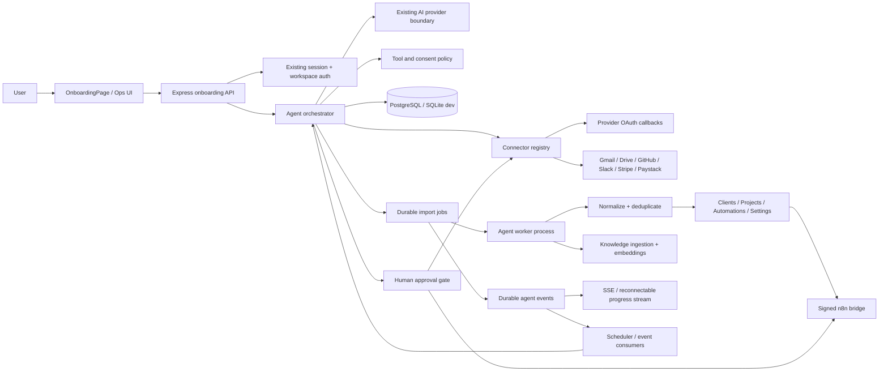

# Setup Agent and Workspace Operations Implementation

Status: implementation design and delivery plan  
Audience: backend, frontend, platform, security, and operations engineers  
Last updated: 2026-07-31

This document turns [`ONBOARDING_DIAGRAM.md`](../ONBOARDING_DIAGRAM.md),
[`ONBOARDING.md`](../ONBOARDING.md), and
[`ONBOARDING_AGENT.md`](../ONBOARDING_AGENT.md) into an implementation plan for
the current lancee codebase.

## 1. Executive decision

Build one workspace-scoped agent orchestration service with two modes:

- `setup`: conversational slot filling, consent collection, connector setup,
  import orchestration, and workspace bootstrapping;
- `operations`: scheduled and event-driven suggestions, drafts, and
  human-approved actions after setup.

The Setup Agent and the future Ops Manager are the same durable agent
identity and state machine. Only the trigger, prompt policy, available tools,
and cadence change.

For the first release, keep the existing authentication boundary: the user and
workspace are created by the current registration flow, then an onboarding
session is created immediately after the first authenticated session. This is
safer and more compatible with the current database model than allowing an
anonymous agent to own data before a workspace exists. A later pre-workspace
experience can add a temporary setup record, but it must be exchanged for a
normal authenticated workspace before any connector token or business data is
stored.

The current application already provides the foundation:

| Existing capability | Reuse in the agent |
| --- | --- |
| [`server/index.mjs`](../server/index.mjs) | Express startup, authentication, same-origin mutation checks, route registration, error handling, shutdown |
| [`server/database.mjs`](../server/database.mjs) | Workspace isolation, PostgreSQL pool/transactions, SQLite development fallback, idempotency, clients, projects, automations, runs, and AI conversation persistence |
| [`server/ai.mjs`](../server/ai.mjs) | Provider-neutral OpenAI-compatible, Anthropic, Gemini, and Hermes completion boundary |
| [`server/google-drive.mjs`](../server/google-drive.mjs) | Existing OAuth and explicitly selected Drive file/folder access |
| [`server/n8n.mjs`](../server/n8n.mjs) | Signed, bounded, durable outbound/inbound automation delivery |
| [`server/mcp.mjs`](../server/mcp.mjs) | Server-only access to the approved Browser/Utilities tool gateway |
| [`server/notifications.mjs`](../server/notifications.mjs) | Optional SMTP notifications |
| [`src/lib/api.ts`](../src/lib/api.ts) | Typed browser API client and idempotent mutation headers |
| [`src/App.tsx`](../src/App.tsx) | Authenticated shell, lazy pages, workspace bootstrap, automation/run state, and current AI entry point |
| `scripts/verify-*.mjs` | Isolated end-to-end verification with temporary databases and local provider stubs |

The following target capabilities do not exist yet and must be added as
first-class components rather than simulated with integration toggles:

- Gmail, Stripe, GitHub, and Slack OAuth/data adapters;
- durable onboarding sessions and slot state;
- a durable import/job queue with leases, retries, checkpoints, and progress;
- structured inference and tool planning;
- granular historical-data consent and audit records;
- knowledge-base document/chunk indexing;
- approval-gated agent actions;
- a cross-process event stream for live progress;
- scheduled/event-driven operations triggers.

The current payment implementation is Paystack, not Stripe. The connector
interface should support both; the first onboarding payment adapter should
either import Paystack data or explicitly report that Stripe is not configured.
The agent must never claim that an unsupported provider is connected.

## 2. Target architecture



### 2.1 Request-path and worker-path separation

The request path should be short and deterministic:

1. authenticate the user and resolve `request.auth.context.workspace.id`;
2. validate the request and idempotency key;
3. run a bounded LLM planning/extraction call when needed;
4. persist the new agent message, slot patch, consent request, or job record;
5. return the current state and a progress cursor.

The request path must not import hundreds of contacts, fetch an entire mailbox,
embed documents, or wait for n8n. Those operations run in the worker path.

The worker path claims a job lease, processes a bounded batch, commits its
checkpoint and progress event, and releases or renews the lease. A crashed
worker can be replaced without losing the import cursor or creating duplicate
domain records.

### 2.2 Agent identity and modes

Do not create a second unrestricted database user for the model. The agent runs
with:

```text
principal = authenticated user
workspace = authenticated workspace
mode = setup | operations
policy = server-selected allowlist
trace = onboarding session / event / approval id
```

Every tool call receives the workspace and principal from the server context,
not from model-generated arguments. The model can propose a domain action; a
server-side policy decides whether that action is allowed, queued, or requires
approval.

## 3. Lifecycle and state machines

### 3.1 Onboarding session

```text
not_started
  -> collecting_profile
  -> awaiting_consent
  -> importing
  -> reviewing
  -> ready

collecting_profile -> paused | failed
awaiting_consent   -> paused | failed
importing          -> paused | failed
reviewing          -> importing | ready | paused
paused             -> collecting_profile | awaiting_consent | importing
failed             -> importing (retry only for retryable jobs)
```

`ready` means the core workspace summary has been generated. It does not mean
every provider has finished importing. The session should expose incomplete
jobs and allow the user to continue working while background imports finish.

### 3.2 Slot state

Initial slots are:

```text
business_type
team_size
billing_model
tool_stack
workspace_timezone
historical_data_consent
operating_preferences
```

Each slot stores `value`, `source`, `confidence`, `status`, and `updatedAt`.
Valid sources are `user`, `provider`, `inference`, and `default`.

The ask/infer rule is deterministic:

1. accept an explicit user value;
2. accept a provider-derived value when confidence is above the configured
   threshold and the evidence is recorded;
3. ask one concise question for a required missing or ambiguous value;
4. never silently convert a low-confidence inference into a fact.

### 3.3 Import job state

```text
queued -> running -> completed
                 -> retry_wait -> running
                 -> paused
                 -> failed
                 -> cancelled
```

Each job has a provider cursor, batch count, item counts, retry count, lease
owner, lease expiry, and last error. A job is complete only after its final
cursor has been committed.

### 3.4 Approval state

```text
pending -> approved -> executing -> succeeded
       \\-> rejected
       \\-> expired
executing -> failed
```

The following actions always require approval unless a separately documented
workspace policy enables them:

- sending email, Slack messages, or other external communication;
- charging, refunding, or changing payment state;
- changing permissions or connector scopes;
- bulk deletion or archival;
- publishing or sending generated client-facing content.

Creating a draft, importing a consented record, or creating a disabled recipe
can be automatic when validation succeeds.

## 4. Backend implementation

### 4.1 Recommended module boundaries

`server/index.mjs` currently contains most route wiring and orchestration. Keep
route registration there initially, but move the new behavior into small
modules so it can later run in a worker or a separate service:

```text
server/
  onboarding/
    service.mjs             session lifecycle and public API
    orchestrator.mjs        turn planning and deterministic state transitions
    policy.mjs              tools, scopes, consent, approval rules
    prompts.mjs             versioned system prompts and output contracts
    events.mjs              append/read/replay event stream
    jobs.mjs                enqueue, claim, renew, retry, cancel
    progress.mjs            aggregate job progress for the UI
  connectors/
    registry.mjs            provider registration and capability lookup
    contract.mjs            common connector interface and schemas
    drive.mjs               adapter around the existing Drive module
    gmail.mjs               OAuth, contacts, threads, and history cursors
    github.mjs              OAuth, organisations, repositories, and activity
    slack.mjs               OAuth, workspace members, channels, and history
    stripe.mjs              OAuth/API import where configured
    paystack.mjs            adapter around the existing Paystack client
  inference/
    profile.mjs             evidence collection and slot inference
    normalize.mjs           provider-neutral records
  knowledge/
    ingest.mjs              document extraction, redaction, chunking
    search.mjs              workspace-filtered retrieval
  workers/
    agent-worker.mjs        process entry point and graceful shutdown
```

The domain write operations should call database/domain service methods, not
make internal HTTP requests to `/api/clients`, `/api/projects`, or
`/api/automations`. This avoids double authentication, duplicate idempotency
records, and network overhead.

### 4.2 Connector contract

Every connector implements a common interface. Provider-specific code stays
behind this boundary:

```ts
type ConnectorDefinition = {
  id: 'gmail' | 'drive' | 'github' | 'slack' | 'stripe' | 'paystack'
  displayName: string
  scopes: Array<{
    id: string
    label: string
    description: string
    historical: boolean
    risk: 'low' | 'medium' | 'high'
  }>
  authorizationUrl(input: AuthorizationInput): Promise<string>
  exchangeCallback(input: CallbackInput): Promise<EncryptedCredential>
  capabilities(): ConnectorCapability[]
  importBatch(input: ImportBatchInput): Promise<ImportBatchResult>
  revoke(input: RevokeInput): Promise<void>
}
```

The normalized import result should use stable provider IDs and preserve source
metadata:

```ts
type NormalizedRecord = {
  provider: string
  providerId: string
  kind: 'contact' | 'client' | 'project' | 'document' | 'message' | 'invoice'
  updatedAt: string | null
  sourceUrl: string | null
  payload: Record<string, unknown>
  sourceScope: string
}
```

Connector rules:

- tokens are exchanged and encrypted on the server;
- OAuth state and PKCE verifier are stored server-side, single-use, and
  expire quickly;
- access scopes are explicit and shown before consent;
- historical scopes are separate from basic connection scopes;
- provider pagination and cursors are persisted after each successful batch;
- provider rate-limit responses become retry metadata, not fatal process errors;
- the browser receives status, display names, scopes, and progress, never tokens;
- imports are restricted to the workspace and the consented provider scope.

The existing `google_drive_tokens` and Paystack tables can remain compatible
for the first release. A later migration may consolidate credentials into a
workspace/provider credential table, but it must preserve current encryption
and revocation behavior.

### 4.3 Structured agent orchestration

The existing `completeChat()` is a text-completion boundary. Use it for the
first version, but do not let free-form model output directly mutate the
database. Add a server-side structured envelope:

```json
{
  "assistantMessage": "I can import your Drive contacts next.",
  "slotPatches": [
    {
      "name": "billing_model",
      "value": "project",
      "source": "user",
      "confidence": 1
    }
  ],
  "question": null,
  "requestedConsents": ["drive.contacts", "drive.historical_documents"],
  "proposedActions": [
    {
      "type": "enqueue_import",
      "provider": "drive",
      "scope": "drive.contacts",
      "requiresApproval": false
    }
  ],
  "nextState": "awaiting_consent"
}
```

Validate this envelope with a strict schema before applying it. Unknown action
types, providers, scopes, oversized strings, invalid confidence values, and
workspace IDs are rejected. Store the prompt/schema version with each turn so
behavior can be audited and replayed.

The system prompt should describe the current slot values and summarized
evidence, not dump an entire mailbox or document corpus into every request.
The model may choose among server-provided tools such as:

```text
read_profile
list_connector_capabilities
request_connector_consent
infer_profile_slots
enqueue_import
get_import_progress
create_client_draft
create_project_draft
create_automation_draft
create_knowledge_ingest_job
request_external_action_approval
```

`create_client_draft`, `create_project_draft`, and similar tools call validated
domain methods. `send_email`, `charge_payment`, and equivalent side effects are
not available during setup; they produce an approval record for the later
operations mode.

### 4.4 Suggested database additions

The current schema is created in [`server/database.mjs`](../server/database.mjs)
and supports PostgreSQL plus a single-process SQLite fallback. Add the agent
tables through an additive, versioned migration path. Do not make a production
rollout depend on a destructive `DROP` or on an in-memory queue.

| Table | Important columns | Indexes/constraints |
| --- | --- | --- |
| `agent_sessions` | `id`, `workspace_id`, `user_id`, `mode`, `state`, `phase`, `slots_json`, `prompt_version`, `created_at`, `updated_at`, `completed_at` | `(workspace_id, updated_at)`, one active setup session per workspace/user |
| `agent_messages` | `id`, `session_id`, `workspace_id`, `role`, `content`, `structured_json`, `tokens_used`, `created_at` | `(session_id, created_at)`, bounded content size |
| `agent_consents` | `id`, `session_id`, `workspace_id`, `provider`, `scope`, `status`, `granted_by`, `granted_at`, `revoked_at`, `evidence_json` | unique `(workspace_id, provider, scope)` for active consent |
| `connector_accounts` | `id`, `workspace_id`, `provider`, `status`, encrypted credential fields, `scopes_json`, `cursor_json`, timestamps | unique `(workspace_id, provider)`, no plaintext token |
| `agent_jobs` | `id`, `workspace_id`, `session_id`, `type`, `provider`, `state`, `cursor_json`, `total_count`, `completed_count`, `attempts`, `available_at`, lease fields, error fields | `(state, available_at)`, `(workspace_id, session_id)`, idempotency key |
| `agent_job_items` | `job_id`, `provider_id`, `kind`, normalized hash, target ID, status, error | unique `(job_id, provider_id, kind)` |
| `agent_events` | `id`, `workspace_id`, `session_id`, monotonic `sequence`, `type`, `payload_json`, `created_at` | unique `(session_id, sequence)`, `(session_id, sequence)` for replay |
| `agent_approvals` | `id`, `workspace_id`, `session_id`, `action_type`, `payload_json`, `status`, expiry, reviewer, execution fields | `(workspace_id, status, expires_at)` |
| `knowledge_documents` | `id`, `workspace_id`, provider/source IDs, content hash, sensitivity, consent, status, timestamps | unique source identity/hash, `(workspace_id, status)` |
| `knowledge_chunks` | `id`, `document_id`, `workspace_id`, chunk text or object-store key, embedding reference, token count | `(workspace_id, document_id)`, vector index when enabled |

Use foreign keys to `workspaces`, `users`, and `agent_sessions`. Every query
must include the resolved workspace ID. Avoid storing unbounded message or
document bodies in rows that are read on every dashboard request; keep text
bounded or move large content to controlled object storage.

The existing `ai_conversations` table can retain the canonical compact chat
history for compatibility. `agent_messages` should hold the structured
orchestration record and import/approval references so the conversational log
does not become the job system.

### 4.5 API contract

All authenticated mutations use `secureMutations`, same-origin validation, and
the existing `Idempotency-Key` contract. Never accept `workspaceId` from the
browser as an authorization input.

| Method | Route | Purpose |
| --- | --- | --- |
| `GET` | `/api/onboarding` | Return whether setup is needed and the active session summary |
| `POST` | `/api/onboarding/sessions` | Create or resume the workspace setup session |
| `GET` | `/api/onboarding/sessions/:id` | Return state, slots, connectors, jobs, approvals, and summary |
| `POST` | `/api/onboarding/sessions/:id/messages` | Append a user turn, run bounded orchestration, and return the assistant envelope |
| `GET` | `/api/onboarding/sessions/:id/events?after=N` | Replayable SSE progress stream |
| `POST` | `/api/onboarding/connectors/:provider/start` | Create a short-lived OAuth authorization request for approved scopes |
| `GET` | `/api/onboarding/connectors/:provider/callback` | Complete OAuth exchange and enqueue post-connect discovery |
| `POST` | `/api/onboarding/sessions/:id/consents` | Grant or deny a named provider scope |
| `POST` | `/api/onboarding/jobs/:id/pause` | Pause an import job |
| `POST` | `/api/onboarding/jobs/:id/resume` | Resume a paused/retryable import job |
| `POST` | `/api/onboarding/jobs/:id/cancel` | Cancel future work without deleting imported records |
| `POST` | `/api/onboarding/approvals/:id/decision` | Approve or reject a proposed side effect |
| `POST` | `/api/onboarding/skip` | Explicitly defer setup and record the user choice |
| `GET` | `/api/operations/summary` | Return the steady-state digest inputs and pending approvals |

A message response should be immediately useful even if imports are still
running:

```json
{
  "session": {
    "id": "ons_…",
    "state": "importing",
    "phase": "contacts"
  },
  "assistant": {
    "id": "msg_…",
    "content": "I found 210 contacts and started importing them in batches.",
    "question": null
  },
  "jobs": [
    {
      "id": "job_…",
      "type": "import_contacts",
      "status": "running",
      "completed": 40,
      "total": 210
    }
  ],
  "nextEventSequence": 18
}
```

SSE events should be small and replayable:

```text
id: 18
event: agent.progress
data: {"jobId":"job_…","completed":40,"total":210}

id: 19
event: agent.state
data: {"state":"importing","phase":"contacts"}
```

Send heartbeats, close connections on shutdown, and let the client reconnect
with `after=<last sequence>`. In a multi-instance deployment, events must be
read from PostgreSQL/Redis rather than a process-local array.

### 4.6 Domain import mapping

Imports must be additive, idempotent, and reviewable. A suggested first map is:

| Source | Target | Rule |
| --- | --- | --- |
| Gmail contacts and consented threads | `clients` | Deduplicate by workspace + normalized email/domain; keep source URL in audit metadata |
| Stripe or Paystack customers/invoices | `clients`, invoice staging, billing evidence | Never mark a lancee invoice paid from import alone; require verified provider reconciliation |
| GitHub repositories | `projects` drafts | Create drafts with source link and `Waiting on client`/`In progress` only after confidence checks |
| Slack members/channels | team evidence and optional contacts | Do not import private messages without a separate explicit scope |
| Drive selected folders/files | `workspace_documents`, knowledge jobs, project/client links | Respect the existing selected-file boundary and source permissions |
| Inferred profile | `workspace_settings`, disabled automations, recipes | Write only validated fields; show a summary before enabling external actions |

Use `ensureClient`-style upserts or new provider-identity mappings. Do not
identify people only by display name. Record conflicts for user review instead
of silently merging two organizations.

## 5. Frontend implementation

### 5.1 Shell integration

The authenticated shell in [`src/App.tsx`](../src/App.tsx) already loads
workspace data after `api.auth.session()`. Add onboarding bootstrap to that
load, but keep it lightweight:

```ts
const onboarding = await api.onboarding.get()
if (onboarding.required && !onboarding.dismissed) {
  setActivePage('onboarding')
}
```

Add a lazy `OnboardingPage` and a page ID. The page should be reachable from
the sidebar after the first-run redirect, so a user can pause setup and return
later. Do not block the entire dashboard on provider discovery or import
counts.

Suggested new files:

```text
src/components/onboarding/OnboardingPage.tsx
src/components/onboarding/OnboardingChat.tsx
src/components/onboarding/ConnectorConsentCard.tsx
src/components/onboarding/ImportProgress.tsx
src/components/onboarding/ApprovalCard.tsx
src/components/onboarding/onboarding.css
```

Extend [`src/lib/api.ts`](../src/lib/api.ts) with typed `api.onboarding` and
`api.operations` namespaces. Reuse `mutationHeaders(true)` for messages,
consents, job controls, skip, and approval decisions.

### 5.2 Conversation behavior

The UI is conversational, not a numbered wizard:

1. show a short welcome and the first required question;
2. append user text optimistically with a local sending state;
3. submit exactly once with an idempotency key;
4. render the assistant message and any consent/action cards from the validated
   server envelope;
5. open OAuth in the provider's normal redirect/popup flow;
6. subscribe to progress only after a job exists;
7. keep the chat usable while imports run;
8. show a summary with created records, skipped items, warnings, and remaining
   jobs.

The client may keep a non-secret resume marker such as session ID and last
event sequence. It must not store connector tokens, raw provider payloads,
or approval credentials. The service worker must continue to bypass API
responses as described in [`docs/OFFLINE_PWA.md`](OFFLINE_PWA.md).

### 5.3 Connector consent UX

Each provider card must display:

- provider name and connection status;
- basic scopes and historical scopes separately;
- exact data categories to be imported;
- whether the scope creates drafts or can trigger an external action;
- revoke/skip controls;
- a link to privacy/retention information.

The default should be least privilege. “Connect Gmail” must not implicitly
mean “read all historical email”; that is a separate consent choice. For the
South African deployment, retain consent and revocation audit records suitable
for POPIA review.

### 5.4 Progress and approval UX

Progress should be rendered from server events and periodically refreshed from
`GET /api/onboarding/sessions/:id`. It should show counts and phase names, not
provider secrets or raw message bodies:

```text
Contacts       40 / 210   Importing
Projects       12 / 12    Complete
Documents      8 / 96     Waiting for consent
Knowledge      0 / 96     Queued
```

Approval cards must show the exact proposed action, destination, generated
content preview, source evidence, expiry, and Approve/Edit/Reject actions.
There is no “approve all future actions” control in the first release.

## 6. Ongoing operations mode

After the onboarding session reaches `ready`, the same orchestrator can produce
an operations digest. The event engine should trigger a read-only analysis,
then persist drafts and approvals:

```text
cron/event -> collect bounded workspace facts
           -> infer risks and opportunities
           -> create digest + draft messages
           -> create approval records for external effects
           -> notify user / show in dashboard
           -> execute only approved actions
```

Initial read-only signals can reuse current `clients`, `projects`, invoices,
and automation runs:

- projects ready for billing;
- clients without a response for a configured number of days;
- blocked or stale projects;
- failed n8n runs;
- pending approvals and incomplete imports.

Do not implement a second operations agent. Store a `mode=operations` event
and use the same prompt/tool/policy versioning and audit trail.

For v1, scheduled delivery can use a dedicated worker scheduler. The existing
n8n bridge can deliver approved events, but n8n should not be treated as the
source of truth for agent state. A future event bus can subscribe to domain
events such as `project.updated`, `invoice.ready`, and `connector.imported`.

## 7. Security, privacy, and reliability requirements

### 7.1 Authorization and secret handling

- Resolve user, role, and workspace from the existing signed HTTP-only session.
- Enforce workspace predicates in every query and job claim.
- Use owner checks for connector configuration and workspace-wide consent.
- Store OAuth tokens and provider secrets encrypted server-side; keep only
  hashes/fingerprints where retrieval is unnecessary.
- Never put secrets in model prompts, browser state, logs, SSE payloads, or
  `ai_conversations`.
- Redact email addresses, message bodies, access tokens, and provider payloads
  from normal logs.
- Validate provider redirect URIs, exact origins, state, PKCE, expiry, and
  single-use callback semantics.
- Retain the current same-origin mutation and idempotency protections.

### 7.2 Model safety boundary

The LLM is an untrusted planner, not an authorization system. The backend must
validate:

- tool name and version;
- provider and consent scope;
- target workspace and record IDs;
- maximum batch size and content length;
- whether approval is mandatory;
- whether the action is allowed in `setup` or `operations` mode.

Prompt injection from imported email, documents, GitHub issues, or Slack must be
treated as untrusted data. Mark imported content as data in the prompt, never
as instructions. Retrieval must preserve source/workspace permissions.

### 7.3 Failure behavior

- If the model is unavailable, preserve the user message and show a retryable
  state; do not lose the session.
- If a provider is unavailable, pause only the affected job and continue other
  imports.
- If a batch partially fails, commit successful items and retry only failed or
  unconfirmed items.
- If an OAuth token expires, mark the connector reauthorization-required and
  stop dependent jobs safely.
- If a worker crashes, its lease expires and another worker reclaims the job.
- If the browser disconnects, progress remains durable and is replayed on
  reconnect.
- If a user revokes consent, stop future reads, retain already-created domain
  records according to the retention policy, and offer a data-removal request.

## 8. Performance and scalability

### 8.1 Current deployment constraints

The current PM2 configuration runs one forked `server/index.mjs` process, and
SQLite is intentionally a single-process development fallback. Production
should use PostgreSQL as already documented in
[`docs/SCALABILITY_AND_POSTGRESQL.md`](SCALABILITY_AND_POSTGRESQL.md).

The setup agent should therefore ship in two stages:

1. **Single-instance pilot:** PostgreSQL-backed sessions/jobs, one worker
   process, SSE backed by durable events, bounded concurrency.
2. **Scaled deployment:** separate API and worker processes, shared queue,
   shared rate limits, PostgreSQL event cursors, and object/vector storage.

Do not use a process-local `Map` for job ownership, progress, rate limits, or
agent session state.

### 8.2 Request and model efficiency

- Keep onboarding API responses small; paginate messages, jobs, and evidence.
- Summarize old conversation turns after a configurable token threshold.
- Cache the normalized workspace profile and connector capability metadata.
- Do not repeat the same inference call when the relevant slot/evidence hash
  has not changed.
- Use low temperature and small output limits for slot extraction and planning.
- Use a separate, larger context path only for document synthesis.
- Record prompt, completion, and retrieval token counts per session and job.
- Apply per-user and per-workspace model rate limits and a daily budget.
- Fail fast on provider timeouts and use bounded retries with jitter.

### 8.3 Import throughput

- Process provider pages in batches, beginning with a conservative default such
  as 50–100 records.
- Limit concurrent provider requests per provider and per workspace.
- Use exponential backoff for `429` and transient `5xx` responses.
- Persist cursors after every successful batch, not only at job completion.
- Hash normalized records to avoid reprocessing unchanged content.
- Use bulk inserts/upserts for large batches, but keep transactions bounded.
- Add indexes for workspace, provider identity, job state, and timestamps.
- Move large documents to object storage and enqueue embeddings separately.

### 8.4 Queue and horizontal scaling

For the pilot, `agent_jobs` plus PostgreSQL row locks/advisory locks can provide
durable leasing. At sustained volume, use Redis Streams/BullMQ or a managed
durable queue for delivery while keeping the database as the source of truth.

The worker must support:

- configurable concurrency;
- graceful shutdown and lease renewal;
- dead-letter handling;
- retry classification;
- per-provider circuit breakers;
- metrics for queue age, job duration, retry count, and failed items.

SSE connections should be stateless. Use a reverse-proxy-friendly heartbeat,
reconnect cursors, and a shared event source. If a proxy cannot sustain long
SSE connections, add a polling fallback; correctness must not depend on a live
browser connection.

### 8.5 Observability

Every agent turn, provider call, job, event, and approval should have:

```text
request_id
workspace_id
session_id
job_id (when applicable)
provider
model/prompt version (when applicable)
duration_ms
status/error code
```

Emit metrics without sensitive payloads:

- onboarding completion and abandonment by phase;
- model latency, errors, and token cost;
- provider latency, rate-limit responses, and import throughput;
- queue depth/age and job retry/dead-letter counts;
- SSE reconnects and event lag;
- approval latency and execution outcomes.

## 9. Environment and setup

Retain the existing environment variables for the database, AI, SMTP, Drive,
Paystack, n8n, MCP, and Codex. Add the following server-only settings to
`.env.example` when implementation begins:

```dotenv
# Setup Agent
ONBOARDING_AGENT_ENABLED=false
ONBOARDING_AGENT_MODE=setup
AGENT_QUEUE_URL=
AGENT_WORKER_CONCURRENCY=4
AGENT_IMPORT_BATCH_SIZE=50
AGENT_JOB_LEASE_SECONDS=120
AGENT_SSE_HEARTBEAT_MS=15000
AGENT_MAX_CONTEXT_TOKENS=8000
AGENT_DAILY_TOKEN_BUDGET=100000
AGENT_KNOWLEDGE_BACKEND=postgres

# OAuth connector credentials (server-only)
GMAIL_CLIENT_ID=
GMAIL_CLIENT_SECRET=
GMAIL_REDIRECT_URI=
GITHUB_CLIENT_ID=
GITHUB_CLIENT_SECRET=
GITHUB_REDIRECT_URI=
SLACK_CLIENT_ID=
SLACK_CLIENT_SECRET=
SLACK_REDIRECT_URI=
STRIPE_CLIENT_ID=
STRIPE_CLIENT_SECRET=
STRIPE_REDIRECT_URI=
```

Do not enable the feature by default until the verifier and consent review are
complete. Redirect URIs must be registered for local, staging, and production
origins separately. Secrets belong in the deployment secret store or mode
`0600` `.env`, never in Vite-exposed variables.

### 9.1 Local setup sequence

Use the existing workflow from [`docs/GETTING_STARTED.md`](GETTING_STARTED.md):

```bash
pnpm install --frozen-lockfile
cp .env.example .env
pnpm auth:hash
pnpm build
APP_ENV=development PUBLIC_ORIGIN=http://localhost:5177 pnpm start
```

For agent development, add local provider stubs to the verification script
instead of calling real Gmail, Stripe, GitHub, Slack, or LLM services. Start
the API and worker against a temporary database; use PostgreSQL verification
for concurrency and restart behavior.

### 9.2 Production process layout

Extend the current single PM2 app only after the worker is independently
graceful:

```text
lancee-api     -> node server/index.mjs
lancee-worker  -> node server/workers/agent-worker.mjs
lancee-scheduler -> node server/workers/agent-scheduler.mjs
```

All processes share `DATABASE_URL`, the persistent session/encryption secret,
connector secrets, and queue configuration. API processes do not run imports
inline. Database pool totals across all processes must remain below PostgreSQL
limits, with administrative headroom.

## 10. Verification strategy

Add `scripts/verify-onboarding.mjs`, following the existing isolated verifier
style used by `verify-durable-foundation.mjs`, `verify-ai-providers.mjs`,
`verify-n8n-bridge.mjs`, and `verify-workspace-flows.mjs`.

The verifier should use local stubs and assert:

1. a first authenticated load creates/resumes exactly one setup session;
2. a user answer creates one idempotent assistant turn;
3. explicit values outrank inferred values;
4. low-confidence evidence creates a question;
5. historical scopes require separate consent;
6. OAuth state is single-use, expires, and never returns a token to the client;
7. connector batches checkpoint and resume after a forced worker crash;
8. duplicate provider records do not create duplicate clients/projects;
9. all created records stay inside the authenticated workspace;
10. progress events replay after an SSE reconnect;
11. pause, resume, cancel, retry, and dead-letter transitions work;
12. approvals are required for outbound communication/payment actions;
13. rejected/expired approvals never execute;
14. imported prompt-injection text cannot add tools or bypass consent;
15. secrets are absent from response bodies, logs, events, and database payloads;
16. restart persistence works with both SQLite fallback and PostgreSQL;
17. the worker exits cleanly and does not claim a second lease for one job;
18. `pnpm build`, `pnpm lint`, and all existing verification scripts remain green.

Add focused unit coverage for normalization, consent policy, structured output
validation, retry classification, provider cursor handling, and approval
transitions. Use contract tests for each connector adapter against a local stub.

## 11. Delivery phases

### Phase 0 — contracts and safety foundation

- Add feature flag, migration/versioning approach, session/job/event schemas,
  policy module, structured output validator, and audit logging.
- Add API types and a read-only onboarding status endpoint.
- Add the verifier skeleton and local AI/connector stubs.

### Phase 1 — conversational setup without external imports

- Add `OnboardingPage`, session/messages API, slot extraction, and resume flow.
- Reuse `completeChat()` with strict prompt/output versioning.
- Create safe drafts for workspace settings, clients, projects, and disabled
  automations from user-provided data.
- Add summary, skip, pause, and error recovery.

### Phase 2 — first-party connectors and durable imports

- Adapt existing Drive and Paystack boundaries.
- Add one new OAuth connector at a time, starting with the highest-value
  provider for the target customers.
- Add consent UI, encrypted credentials, import batches, progress events,
  deduplication, and restart-safe workers.

### Phase 3 — knowledge base and recipe generation

- Add document extraction, redaction, chunking, embeddings, and retrieval.
- Generate disabled automation recipes from evidence and require review before
  activating n8n or other external behavior.
- Add source/evidence links to the final onboarding summary.

### Phase 4 — operations cadence

- Add scheduler and domain event consumers.
- Generate weekly/daily read-only digests and approval-backed drafts.
- Route only approved actions through existing signed n8n/provider boundaries.
- Scale workers, queueing, rate limits, metrics, and event fan-out.

Roll out each phase behind `ONBOARDING_AGENT_ENABLED` and workspace allowlists.
Keep a kill switch that stops new jobs while allowing operators to inspect and
cancel existing work safely.

## 12. Acceptance criteria

The implementation is ready for a controlled production pilot when:

- a new authenticated workspace can complete the conversation without a fixed
  step wizard;
- the agent asks only for required information it cannot infer and displays
  evidence for inferred values;
- every historical provider scope is separately consented and revocable;
- imports are asynchronous, resumable, deduplicated, and visible in real time;
- all writes are workspace-scoped and idempotent;
- no connector or model secret reaches the browser or logs;
- external side effects are approval-gated;
- the user can pause, skip, resume, or cancel without losing imported work;
- the final summary lists created records, skipped records, warnings, sources,
  and unfinished jobs;
- restart and multi-process tests pass against PostgreSQL;
- the same orchestration service can later run the operations digest without a
  second agent identity or a second data model.

## 13. Implementation checklist by repository area

| Area | Change |
| --- | --- |
| `server/index.mjs` | Register authenticated onboarding routes, OAuth callbacks, SSE, and worker-safe error handling |
| `server/database.mjs` | Add migration-backed tables and workspace-scoped methods for sessions, messages, consents, jobs, events, approvals, and knowledge metadata |
| `server/ai.mjs` | Reuse completion transport; add structured-output validation/token-budget hooks in a separate orchestration module |
| `server/connectors/*` | Add provider contracts and adapters; wrap existing Drive/Paystack behavior |
| `server/onboarding/*` | Implement state machine, policy, planning, progress, and approvals |
| `server/workers/*` | Add durable job worker and scheduler with graceful shutdown |
| `src/lib/api.ts` | Add onboarding/operations types and API methods, including SSE reconnect support |
| `src/components/onboarding/*` | Add conversational setup UI, consent cards, progress, summary, and approvals |
| `src/App.tsx` | Add lazy onboarding page, bootstrap status, navigation, and resume routing |
| `.env.example` | Add disabled-by-default agent, queue, budget, and OAuth settings |
| `package.json` | Add `verify:onboarding`, worker, and scheduler scripts when those entry points exist |
| `scripts/verify-onboarding.mjs` | Verify consent, inference, imports, replay, security, restart, and worker behavior |
| `README.md` and `docs/*` | Keep setup, security, connector scope, and operational runbooks current |

This design intentionally builds on the durable foundation already in the
repository while keeping imports, model planning, external effects, and
steady-state operations independently scalable.
